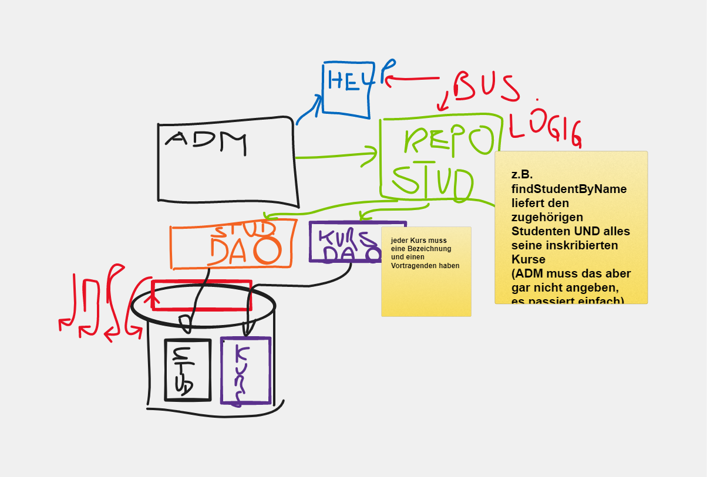
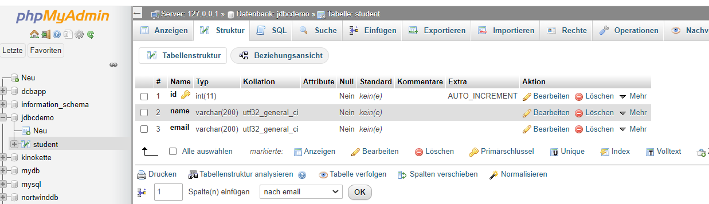
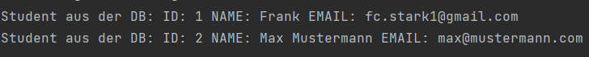
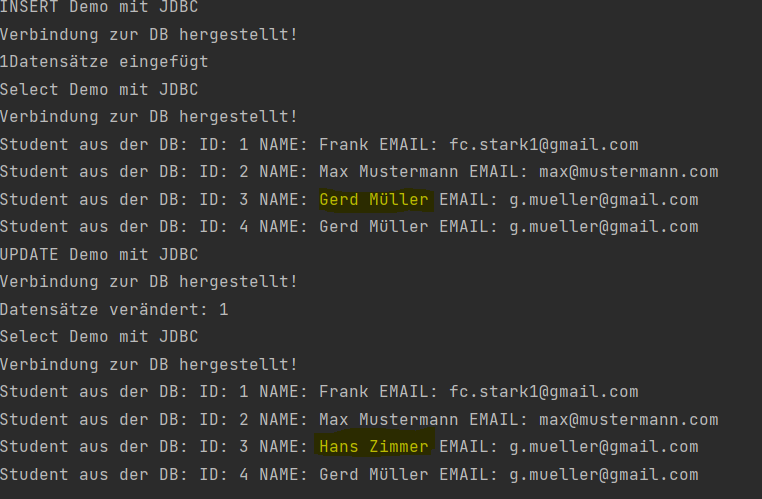
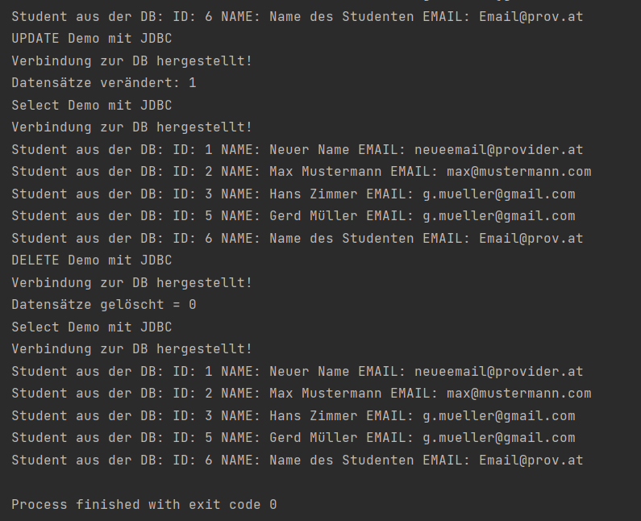
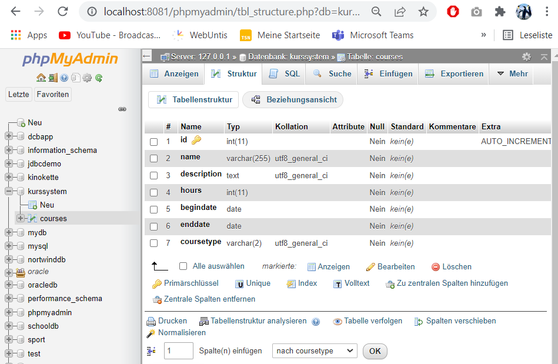

# ÜBUNGSZETTEL „DATENBANKZUGRIFFMIT JAVA, JDBC UND DAO“

DAO
Data Access Object Model (Data Access Object Pattern) oder DAO-Muster für den Low-Level-Datenzugriff API oder aus dem Betrieb von hochwertigen Dienstleistungen getrennt. Im Folgenden ist ein Teilnehmer im Objektmuster Data Access.

Schnittstelle Data Access Objects (Data Access Object Interface) - Diese Schnittstelle definiert die Standardoperationen auf einem Modellobjekt ausgeführt werden.
Data Access Objects Entitätsklassen (Data Access Object konkrete Klasse) - Diese Klasse die oben genannten Schnittstellen implementiert.Diese Klasse ist für die Daten aus der Datenquelle erhalten, kann die Datenquelle eine Datenbank sein, es kann XML oder einem anderen Speichermechanismus sein.
Modellobjekt / Wert - Objekte (Modellobjekt / Value Object) -Das Objekt einfache POJO ist, umfasst / Set - Methoden erhalten zum Speichern von DAO - Klassen Daten abzurufen.
http://www.w3big.com/de/design-pattern/data-access-object-pattern.html

Warum brauchen wir DAO?
- Die Datenquelle ist austauschbar
- Ein Interface zwischen Datenbank und Datenverwender (lose Kopplung) = Dependencie Inversion
- Ein Adapter lässt sich einhängen




Repository
- Daten werden zusammen mit den zusammenhängenden Entiteten bearbeitet.
- Mehrstruktur

JDBC is a programming-level interface for Java applications that communicate with a database. An application uses this API to communicate with a JDBC manager. It's the common API that our application code uses to communicate with the database. Beyond the API is the vendor-supplied, JDBC-compliant driver for the database we're using.
"https://www.baeldung.com/jpa-vs-jdbc"

JPA is a Java standard that allows us to bind Java objects to records in a relational database. It's one possible approach to Object Relationship Mapping(ORM), allowing the developer to retrieve, store, update, and delete data in a relational database using Java objects. Several implementations are available for the JPA specification.
https://www.baeldung.com/jpa-vs-jdbc


<!-- TOC start -->
- [AUFGABE 1: JDBC INTRO TEIL 1](#aufgabe-1-jdbc-intro-teil-1)
  * [Richte die Entwicklungsumgebung ein ](#richte-die-entwicklungsumgebung-ein)
  * [Datenbank anlegen](#datenbank-anlegen)
  * [Datensätze hinzufügen:](#datensätze-hinzufügen)
  * [Daten abfragen](#daten-abfragen)
  * [Daten aktualisieren](#daten-aktualisieren)
<!-- TOC end -->
  


<!-- TOC --><a name="aufgabe-1-jdbc-intro-teil-1"></a>
# AUFGABE 1: JDBC INTRO TEIL 1

<!-- TOC --><a name="richte-die-entwicklungsumgebung-ein"></a>
## Richte die Entwicklungsumgebung ein
- Maven Projekt starten
- Dependencies deklarieren
- Erste Main Klasse deklarieren

<!-- TOC --><a name="datenbank-anlegen"></a>
## Datenbank anlegen
In phpMyAdmin:


<!-- TOC --><a name="datensätze-hinzufügen"></a>
## Datensätze hinzufügen:
``` sql
INSERT INTO `student` (`id`, `name`, `email`) 
VALUES (NULL, 'Frank', 'fc.stark1@gmail.com'), (NULL, 'Max Mustermann', 'max@mustermann.com');
```

## Verbindung herstellen
``` java
public static void selectAllDemo(){

        System.out.println("Select Demo mit JDBC");
        String sqlSelectAllPerson=" SELECT * FROM `student` ";
        //Die Verbindung wird aufgebaut
        String connectionUrl="jdbc:mysql://localhost:3306/jdbcdemo";
        String user="root";
        String pwd="";
        try(Connection conn=DriverManager.getConnection(connectionUrl,user,pwd)){
        System.out.println("Verbindung zur DB hergestellt!");

        }catch(SQLException e){
        System.out.println("Fehler : "+e.getMessage());
        }

        }
```
Ergebnis:


<!-- TOC --><a name="daten-abfragen"></a>
## Daten abfragen
``` java
try(Connection conn = DriverManager.getConnection(connectionUrl, user, pwd)) {
System.out.println("Verbindung zur DB hergestellt!");

            PreparedStatement ps = conn.prepareStatement(sqlSelectAllPerson);
            ResultSet rs = ps.executeQuery();
            //Solange rs.next() nicht null zurückgibt wird die while-Schleife ausgeführt
            while(rs.next()) {
                //Gibt die Daten der angegebenen Spalte zurück.
                long id =  rs.getInt("id");
                String name = rs.getString("name");
                String email = rs.getString("email");
                System.out.println("Student aus der DB: ID: " + id + " NAME: " + name + " EMAIL: " +email);

            }

        }catch(SQLException e) {
            System.out.println("Fehler : " + e.getMessage());
        }
```

Ergebnis


## Daten einfügen
Code:
``` java
public static void insertStudentDemo() {

        System.out.println("INSERT Demo mit JDBC");

        String connectionUrl = "jdbc:mysql://localhost:3306/jdbcdemo";
        String user = "root";
        String pwd = "";
        //Verbindung zur DB wird hergestellt mit einem Connection Object welchem die URL, user und pw mitgegeben werden.
        try (Connection conn = DriverManager.getConnection(connectionUrl, user, pwd)) {

            System.out.println("Verbindung zur DB hergestellt!");

            //Beim eigentlichen Aufruf werden nurnoch die fertigen Datenwerte übergeben. -> Vorbeugung von manuellen SQL-Statements vom User
            PreparedStatement ps = conn.prepareStatement("INSERT INTO `student` (`id`, `name`, `email`) VALUES (NULL, ?, ?)"
            );
            //fertige Datenwerte die dann übergeben werden
            try{
                ps.setString(1,"Gerd Müller");
                ps.setString(2,"g.mueller@gmail.com");

                int rowAffected = ps.executeUpdate();
                System.out.println(rowAffected + "Datensätze eingefügt");

            }catch(SQLException ex){
                System.out.println("Fehler im SQL-INSERT-Statement: " + ex.getMessage());
            }

        } catch (SQLException e) {
            System.out.println("Fehler : " + e.getMessage());
        }


    }
```

Ergebnis


<!-- TOC --><a name="daten-aktualisieren"></a>
## Daten aktualisieren
Code:
``` java
public static void updateStudentDemo(){
        System.out.println("UPDATE Demo mit JDBC");

        String connectionUrl = "jdbc:mysql://localhost:3306/jdbcdemo";
        String user = "root";
        String pwd = "";
        //Verbindung zur DB wird hergestellt mit einem Connection Object welchem die URL, user und pw mitgegeben werden.
        try (Connection conn = DriverManager.getConnection(connectionUrl, user, pwd)) {

            System.out.println("Verbindung zur DB hergestellt!");

            PreparedStatement ps = conn.prepareStatement("UPDATE `student` SET `name` = ? WHERE `student`.`id` = 3"
            );
            try {
                ps.setString(1,"Hans Zimmer");
                int affectedRows = ps.executeUpdate();
                System.out.println("Datensätze verändert: " + affectedRows);
            } catch (SQLException ex) {
                System.out.println("Fehler im SQL-UPDATE-Statement: " + ex.getMessage());
            }

        } catch (SQLException e) {
            System.out.println("Fehler : " + e.getMessage());
        }

    }
```

Ergebnis:


## Loeschen von Datensätze + Parameterübergabe
``` java
public static void deleteStudentDemo(int studentId) {
        System.out.println("DELETE Demo mit JDBC");

        String connectionUrl = "jdbc:mysql://localhost:3306/jdbcdemo";
        String user = "root";
        String pwd = "";
        //Verbindung zur DB wird hergestellt mit einem Connection Object welchem die URL, user und pw mitgegeben werden.
        try (Connection conn = DriverManager.getConnection(connectionUrl, user, pwd)) {

            System.out.println("Verbindung zur DB hergestellt!");

            //Diesmal wird ein Parameter übergeben
            PreparedStatement ps = conn.prepareStatement("DELETE FROM student WHERE student.id = ?"
            );
            try {
                ps.setInt(1,studentId);
                int rowAffected = ps.executeUpdate();
                System.out.println("Datensätze gelöscht = " + rowAffected);
            } catch (SQLException ex) {
                System.out.println("Fehler im SQL-DELETE-Statement: " + ex.getMessage());
            }

        } catch (SQLException e) {
            System.out.println("Fehler : " + e.getMessage());
        }
    }
```

Ergebnis:


# AUFGABE 3: JDBC UND DAO – KURSE 

## Setup 

Datenbank:


## Datenbank-Verbindung
Singelton-Pattern = Einmale Datenbank-Verbindung von Vorteil:

``` java
 public class MysqlDatabaseConnection {
 private static Connection con = null;

    private MysqlDatabaseConnection(){

    }

    //Verbindung zur Datenbank herstellen
    public static Connection getConnection(String url, String user, String pwd) throws ClassNotFoundException, SQLException {

        if(con!=null) {
            return con;
        }
        Class.forName("com.mysql.cj.jdbc.Driver");
        con =  DriverManager.getConnection(url,user,pwd);
        return con;
    }
}
```

Aufbau der Verbindung in der Main-Klasse:

``` java
 try {
            Connection myConnection =
                    MysqlDatabaseConnection.getConnection("jdbc:mysql://localhost:3306/kurssystem","root","");
            System.out.println("Verbindung aufgebaut");
            
        } catch (ClassNotFoundException e) {
            e.printStackTrace();
        } catch (SQLException e) {
            e.printStackTrace();
        }
 ```

## CLI
Command-Line-Interface zur manuellen User-Eingabe später
``` java
package ui;

import java.util.Scanner;

public class CLI {

    Scanner scanner;

    public CLI() {
        this.scanner = new Scanner(System.in);
    }

    public void start() {
        String input = "-";
        while (!input.equals("x")) {
            showMenue();
            input = scanner.nextLine();
            switch (input) {
                case "1":
                    System.out.println("Kurseingabe");
                    break;
                case "2":
                    System.out.println("Alle Kurse");
                    break;
                case "x":
                    System.out.println("Auf Wiedersehen");
                    break;
                default:
                    inputError();
                    break;
            }

        }
        scanner.close();
    }

    private void showMenue() {
        System.out.println("--------------- Kursmanagement -----------");
        System.out.println("(1) Kurs eingeben \t (2) Alle Kurse anzeigen \t");
        System.out.println("(x) ENDE");
    }

    private void inputError(){
        System.out.println("Bitte nur die Zahlen der Menüauswahl eingeben!");
    }
}
```

## Domänenklassen
BaseEntity:
``` java
package domain;

public abstract class BaseEntity {
    private Long id;

    public BaseEntity(Long id) {

        setId(id);

    }


    public Long getId() {
        return id;
    }


    //Hilfsmethode um spätere insert bzw. update Befehle auszuführen.
    public void setId(Long id) {
        if(id==null  || id >= 0){
            this.id = id;
        }else {
            throw new InvalidValueException("Kurs-ID muss größer gleich 0 sein!");


        }
    }

    @Override
    public String toString() {
        return "BaseEntity{" +
                "id=" + id +
                '}';
    }
}

```

Course Entity:
``` java

package domain;

import java.sql.Date;


public class Course extends BaseEntity {


    private String name;
    private String description;
    private int hours;
    private Date beginDate;
    private Date endDate;
    private CourseType courseType;

    public String getName() {
        return name;
    }

    public Course(Long id, String name, String description, int hours, Date beginDate, Date endDate, CourseType courseType) throws InvalidValueException {
        super(id);
        this.setName(name);
        this.setDescription(description);
        this.setHours(hours);
        this.setBeginDate(beginDate);
        this.setEndDate(endDate);
        this.setCourseType(courseType);
    }

    public Course(String name, String description, int hours, Date beginDate, Date endDate, CourseType courseType) {
        super(null);
        this.setName(name);
        this.setDescription(description);
        this.setHours(hours);
        this.setBeginDate(beginDate);
        this.setEndDate(endDate);
        this.setCourseType(courseType);
    }


    public void setName(String name) throws InvalidValueException {

        if (name != null && name.length() > 1) {
            this.name = name;
        } else {
            throw new InvalidValueException("Kursname muss mindesetns 2 Zeichen lang sein.");
        }

    }

    public String getDescription() {
        return description;
    }

    public void setDescription(String description) {
        if (description != null && description.length() > 1) {
            this.description = description;
        } else {
            throw new InvalidValueException("Kursbeschreibung muss mindestens 10 Zeichen lang sein!");


        }

    }

    public int getHours() {
        return hours;
    }

    public void setHours(int hours) throws InvalidValueException {
        if (hours > 0 && hours < 10) {
            this.hours = hours;
        } else {
            throw new InvalidValueException("Anzahl der Kurstunden pro Kurs darf nur zwischen 1 und 10 liegen!");

        }

    }

    public Date getBeginDate() {
        return beginDate;
    }

    public void setBeginDate(Date beginDate) throws InvalidValueException {
        if (beginDate != null) {
            if (this.endDate != null) {
                if (beginDate.before(this.endDate)) {
                    this.beginDate = beginDate;
                } else {
                    throw new InvalidValueException("Kursbeginn muss VOR Kursende sein!");
                }
            } else {
                this.beginDate = beginDate;
            }
        } else {
            throw new InvalidValueException("Startdatum darf nicht null / leer sein!");
        }
    }

    public Date getEndDate() {
        return endDate;
    }

    public void setEndDate(Date endDate) throws InvalidValueException {
        if (endDate != null) {
            if (this.beginDate != null) {
                if (beginDate.after(this.beginDate)) {
                    this.endDate = endDate;
                } else {
                    throw new InvalidValueException("Kursende muss Nach Kursbeginn sein!");
                }
            } else {
                this.endDate = endDate;
            }
        } else {
            throw new InvalidValueException("Enddatum darf nicht null / leer sein!");
        }
    }

    public CourseType getCourseType() {
        return courseType;
    }

    public void setCourseType(CourseType courseType) throws InvalidValueException {
        if (courseType != null) {
            this.courseType = courseType;
        } else {
            throw new InvalidValueException("Kurstyp darf nicht null / leer sein!");
        }


    }

    @Override
    public String toString() {
        return "Course{" +
                "id=xxx" +
                "name='" + name + '\'' +
                ", description='" + description + '\'' +
                ", hours=" + hours +
                ", beginDate=" + beginDate +
                ", endDate=" + endDate +
                ", courseType=" + courseType +
                '}';
    }
}
```


## Repository
In diesem Schritt legen wir uns eine zwei-stufige Interface-Struktur an 1.ein CRUD-Interface in dem alle Standart-Befehle liegen und ein, speziell für die Curses Entitiy angelegtes DAO-REPO.

Main-Repo:
``` java
package dataacces;

import domain.Course;
import domain.CourseType;

import java.sql.Date;
import java.util.List;


public interface MyCourseRepository  extends BaseRepository<Course,Long>{


    List<Course> findAllCourseByName(String name);

    List<Course> findAllCourseByDescription(String description);

    List<Course> findAllCourseByNameOrDescription(String searchText);

    List<Course> findAllCourseByCourseType(CourseType courseType);

    List<Course> findAllCourseByStartDate(Date startDate);

    List<Course> findAllRunningCourses();


}

```
Spezfisches Domänenklassen-Repo "Courses":
``` java
package dataacces;

import java.util.List;
import java.util.Optional;


public interface BaseRepository<T,I> {

    Optional<T> insert(T entity);
    Optional<T> getById(I id);
    List<T> getAll();
    Optional<T> update(T entity);
    void deleteById(I id);

}

```

## CRUD-Methoden
siehe MySqlCourseRepository


# AUFGABE 4: JDBC UND DAO – STUDENTEN
Erstellung der Entitiy


        


