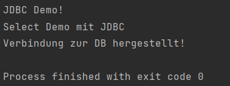
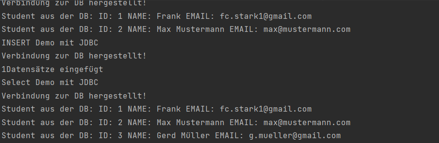

# ÜBUNGSZETTEL „DATENBANKZUGRIFFMIT JAVA, JDBC UND DAO“

Warum brauchen wir DAO?
- Die Datenquelle ist austauschbar
- Ein Interface zwischen Datenbank und Datenverwender (lose Kopplung) = Dependencie Inversion
- Ein Adapter lässt sich einhängen


Repository
- Daten werden zusammen mit den zusammenhängenden Entiteten bearbeitet.
- Mehrstruktur

JDBC is a programming-level interface for Java applications that communicate with a database. An application uses this API to communicate with a JDBC manager. It's the common API that our application code uses to communicate with the database. Beyond the API is the vendor-supplied, JDBC-compliant driver for the database we're using.
"https://www.baeldung.com/jpa-vs-jdbc"

JPA is a Java standard that allows us to bind Java objects to records in a relational database. It's one possible approach to Object Relationship Mapping(ORM), allowing the developer to retrieve, store, update, and delete data in a relational database using Java objects. Several implementations are available for the JPA specification.
https://www.baeldung.com/jpa-vs-jdbc


<!-- TOC start -->
- [AUFGABE 1: JDBC INTRO TEIL 1](#aufgabe-1-jdbc-intro-teil-1)
  * [Richte die Entwicklungsumgebung ein ](#richte-die-entwicklungsumgebung-ein)
  * [Datenbank anlegen](#datenbank-anlegen)
  * [Datensätze hinzufügen:](#datensätze-hinzufügen)
  * [Daten abfragen](#daten-abfragen)
  * [Daten aktualisieren](#daten-aktualisieren)
<!-- TOC end -->
  


<!-- TOC --><a name="aufgabe-1-jdbc-intro-teil-1"></a>
# AUFGABE 1: JDBC INTRO TEIL 1

<!-- TOC --><a name="richte-die-entwicklungsumgebung-ein"></a>
## Richte die Entwicklungsumgebung ein
- Maven Projekt starten
- Dependencies deklarieren
- Erste Main Klasse deklarieren

<!-- TOC --><a name="datenbank-anlegen"></a>
## Datenbank anlegen
In phpMyAdmin:


<!-- TOC --><a name="datensätze-hinzufügen"></a>
## Datensätze hinzufügen:
``` sql
INSERT INTO `student` (`id`, `name`, `email`) 
VALUES (NULL, 'Frank', 'fc.stark1@gmail.com'), (NULL, 'Max Mustermann', 'max@mustermann.com');
```

## Verbindung herstellen
``` java
public static void selectAllDemo(){

        System.out.println("Select Demo mit JDBC");
        String sqlSelectAllPerson=" SELECT * FROM `student` ";
        //Die Verbindung wird aufgebaut
        String connectionUrl="jdbc:mysql://localhost:3306/jdbcdemo";
        String user="root";
        String pwd="";
        try(Connection conn=DriverManager.getConnection(connectionUrl,user,pwd)){
        System.out.println("Verbindung zur DB hergestellt!");

        }catch(SQLException e){
        System.out.println("Fehler : "+e.getMessage());
        }

        }
```
Ergebnis:


<!-- TOC --><a name="daten-abfragen"></a>
## Daten abfragen
``` java
try(Connection conn = DriverManager.getConnection(connectionUrl, user, pwd)) {
System.out.println("Verbindung zur DB hergestellt!");

            PreparedStatement ps = conn.prepareStatement(sqlSelectAllPerson);
            ResultSet rs = ps.executeQuery();
            //Solange rs.next() nicht null zurückgibt wird die while-Schleife ausgeführt
            while(rs.next()) {
                //Gibt die Daten der angegebenen Spalte zurück.
                long id =  rs.getInt("id");
                String name = rs.getString("name");
                String email = rs.getString("email");
                System.out.println("Student aus der DB: ID: " + id + " NAME: " + name + " EMAIL: " +email);

            }

        }catch(SQLException e) {
            System.out.println("Fehler : " + e.getMessage());
        }
```

Ergebnis


## Daten einfügen
Code:
``` java
public static void insertStudentDemo() {

        System.out.println("INSERT Demo mit JDBC");

        String connectionUrl = "jdbc:mysql://localhost:3306/jdbcdemo";
        String user = "root";
        String pwd = "";
        //Verbindung zur DB wird hergestellt mit einem Connection Object welchem die URL, user und pw mitgegeben werden.
        try (Connection conn = DriverManager.getConnection(connectionUrl, user, pwd)) {

            System.out.println("Verbindung zur DB hergestellt!");

            //Beim eigentlichen Aufruf werden nurnoch die fertigen Datenwerte übergeben. -> Vorbeugung von manuellen SQL-Statements vom User
            PreparedStatement ps = conn.prepareStatement("INSERT INTO `student` (`id`, `name`, `email`) VALUES (NULL, ?, ?)"
            );
            //fertige Datenwerte die dann übergeben werden
            try{
                ps.setString(1,"Gerd Müller");
                ps.setString(2,"g.mueller@gmail.com");

                int rowAffected = ps.executeUpdate();
                System.out.println(rowAffected + "Datensätze eingefügt");

            }catch(SQLException ex){
                System.out.println("Fehler im SQL-INSERT-Statement: " + ex.getMessage());
            }

        } catch (SQLException e) {
            System.out.println("Fehler : " + e.getMessage());
        }


    }
```

Ergebnis


<!-- TOC --><a name="daten-aktualisieren"></a>
## Daten aktualisieren
Code:
``` java
public static void updateStudentDemo(){
        System.out.println("UPDATE Demo mit JDBC");

        String connectionUrl = "jdbc:mysql://localhost:3306/jdbcdemo";
        String user = "root";
        String pwd = "";
        //Verbindung zur DB wird hergestellt mit einem Connection Object welchem die URL, user und pw mitgegeben werden.
        try (Connection conn = DriverManager.getConnection(connectionUrl, user, pwd)) {

            System.out.println("Verbindung zur DB hergestellt!");

            PreparedStatement ps = conn.prepareStatement("UPDATE `student` SET `name` = ? WHERE `student`.`id` = 3"
            );
            try {
                ps.setString(1,"Hans Zimmer");
                int affectedRows = ps.executeUpdate();
                System.out.println("Datensätze verändert: " + affectedRows);
            } catch (SQLException ex) {
                System.out.println("Fehler im SQL-UPDATE-Statement: " + ex.getMessage());
            }

        } catch (SQLException e) {
            System.out.println("Fehler : " + e.getMessage());
        }

    }
```

Ergebnis:


## Loeschen von Datensätze + Parameterübergabe
``` java
public static void deleteStudentDemo(int studentId) {
        System.out.println("DELETE Demo mit JDBC");

        String connectionUrl = "jdbc:mysql://localhost:3306/jdbcdemo";
        String user = "root";
        String pwd = "";
        //Verbindung zur DB wird hergestellt mit einem Connection Object welchem die URL, user und pw mitgegeben werden.
        try (Connection conn = DriverManager.getConnection(connectionUrl, user, pwd)) {

            System.out.println("Verbindung zur DB hergestellt!");

            //Diesmal wird ein Parameter übergeben
            PreparedStatement ps = conn.prepareStatement("DELETE FROM student WHERE student.id = ?"
            );
            try {
                ps.setInt(1,studentId);
                int rowAffected = ps.executeUpdate();
                System.out.println("Datensätze gelöscht = " + rowAffected);
            } catch (SQLException ex) {
                System.out.println("Fehler im SQL-DELETE-Statement: " + ex.getMessage());
            }

        } catch (SQLException e) {
            System.out.println("Fehler : " + e.getMessage());
        }
    }
```

Ergebnis:

        


